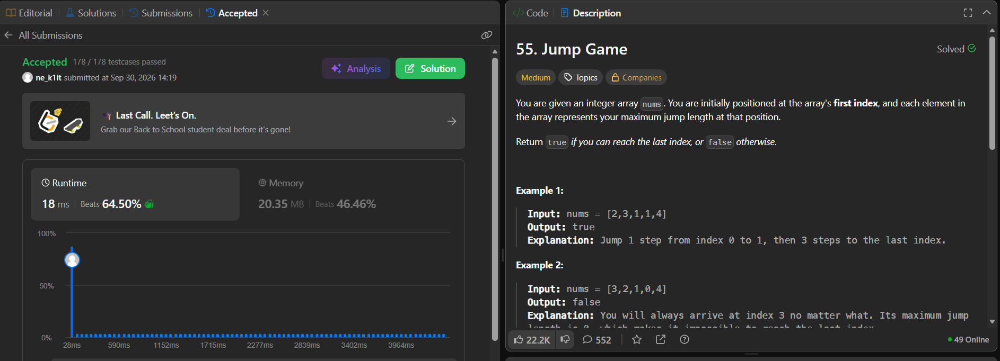
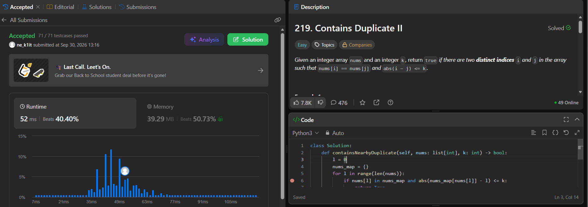
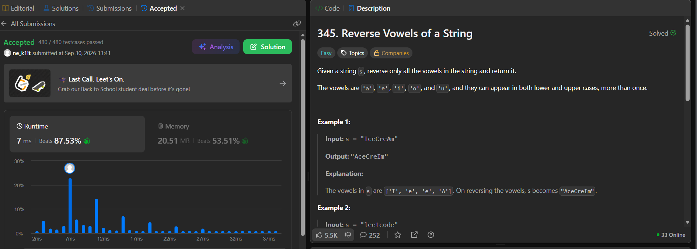

# LeetCode Solutions

Репозиторий содержит решения задач с платформы **LeetCode**, выполненные на языке **Python**.

Основная цель проекта — практика алгоритмов и структур данных, а также развитие навыков решения задач и написания чистого кода.

## Решённые задачи

| №   | Название                                                                                | Сложность | Тема                       |
| --- | --------------------------------------------------------------------------------------- | --------- | -------------------------- |
| 55  | [Jump Game](https://leetcode.com/problems/jump-game/)                                   | Medium    | Greedy, Arrays             |
| 219 | [Contains Duplicate II](https://leetcode.com/problems/contains-duplicate-ii/)           | Medium    | Hash Table, Sliding Window |
| 345 | [Reverse Vowels of a String](https://leetcode.com/problems/reverse-vowels-of-a-string/) | Easy      | Two Pointers, String       |

## Структура проекта

```text
python_course/
│
├── problems/
│   ├── 55_jump_game.py
│   ├── 219_contains_duplicate_ii.py
│   └── 345_reverse_vowels.py
│
├── screenshots/
│   ├── task55.png
│   ├── task219.png
│   └── task345.png
│
├── .gitignore
├── .pre-commit-config.yaml
├── pyproject.toml
└── README.md
```

### `problems/`

Содержит решения задач LeetCode. Каждый файл соответствует отдельной задаче.

### `screenshots/`

Содержит скриншоты успешного прохождения задач на LeetCode.

## Решения задач

### 55 — Jump Game

**Сложность:** Medium

**Основная идея:** жадный алгоритм.

Необходимо определить, можно ли из первого элемента массива добраться до последнего, учитывая максимальную длину прыжка из каждой позиции.

Файл решения:

```text
problems/55_jump_game.py
```

Скриншот успешного прохождения:



---

### 219 — Contains Duplicate II

**Сложность:** Medium

**Основная идея:** хеш-таблица.

Необходимо определить, существуют ли два одинаковых элемента массива, расстояние между индексами которых не превышает `k`.

Файл решения:

```text
problems/219_contains_duplicate_ii.py
```

Скриншот успешного прохождения:



---

### 345 — Reverse Vowels of a String

**Сложность:** Easy

**Основная идея:** два указателя.

Необходимо развернуть только гласные буквы в строке, оставив остальные символы на своих местах.

Файл решения:

```text
problems/345_reverse_vowels.py
```

Скриншот успешного прохождения:



## 🛠 Используемые технологии

* **Python 3.13** — язык программирования
* **Git** — система контроля версий
* **GitHub** — хранение и публикация репозитория
* **Ruff** — линтер и форматтер Python-кода
* **pre-commit** — автоматический запуск проверок перед commit

## 🚀 Проверка

Установить зависимости:

```bash
python3 -m pip install ruff pre-commit
```

Установить pre-commit hooks:

```bash
pre-commit install
```

Запустить проверки для всего репозитория:

```bash
pre-commit run --all-files
```

Используются следующие проверки:

* `ruff-check` — проверка кода;
* `ruff-format` — проверка форматирования.

Пример успешного выполнения:

```text
ruff-check........................................Passed
ruff-format.......................................Passed
```
